# Ceph Dashboard
- [Ceph Dashboard](#ceph-dashboard)
  - [1.Dashboard](#1dashboard)
  - [2.Cluster](#2cluster)
    - [2.1 Hosts](#21-hosts)
    - [2.2 Monitors](#22-monitors)
    - [2.3 OSDs](#23-osds)
    - [2.4 Configuration](#24-configuration)
    - [2.5 CRUSH map](#25-crush-map)
    - [2.6 Ceph Manager Modules](#26-ceph-manager-modules)
    - [2.7 Logs](#27-logs)
  - [3.Pools](#3pools)
  - [4.Block](#4block)
  - [5.NFS](#5nfs)
  - [6.Filesystems](#6filesystems)
  - [7.Object Gateway](#7object-gateway)
  - [8. Ceph Dashboard 사용자 관리](#8-ceph-dashboard-사용자-관리)

## 1.Dashboard

Ceph Dashboard의 메인 화면인 Dashboard 탭은 클러스터의 전반적인 상태, 퍼포먼스, 용량을 모니터링할 수 있는 화면이며 Cluster Status, Monitors, OSDs 등의 세부 항목으로 이뤄집니다.

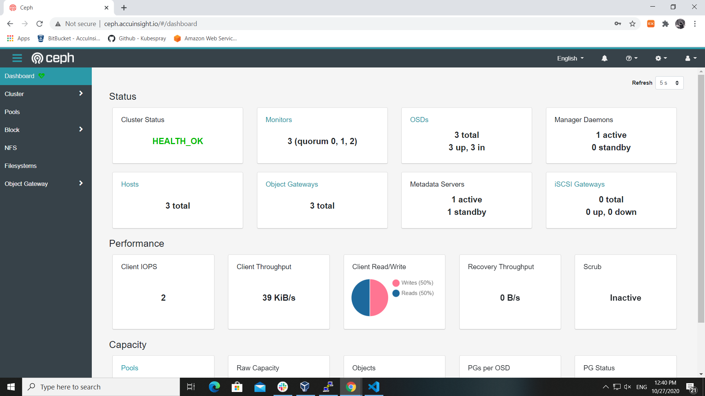

- **Cluster Status** - 클러스터의 전반적인 헬스 상태를 보여주는 항목입니다. 클러스터에 문제가 발생할 경우 에러에 대한 간단한 설명과 에러 로그으로 이동할 수 있는 링크르 제공합니다.
- **Monitors** - 이 항목은 Monitor의 총 갯수와 각 Monitor들의 Quorum 상태, 열러있는 세션 정보 등을 확인할 수 있으며 상세 페이지로 이동하는 링크도 제공합니다.
- **OSDs** - Ceph 클러스터에 있는 전체 오브젝트 스토리지 데몬(OSD)의 갯수, 현재 실행주인 OSD 갯수(up), 클러스터에 포함되어 있는 OSD갯수(in)와 제외 되어 있는 OSD들의 갯수(out)를 표시하는 항목입니다.
- **Manager Daemons** - 전체 Manager(mgr)의 갯수를 active나 standby 상태로 구분하여 표시해주는 항목입니다.
- **Hosts** - 클러스터에 포함된 모든 호스트의 갯수를 보여주는 항목이며 링크를 통해 상세 페이지로 이동할 수 있습니다.
- **Object Gateways** - 현재 작동중인 모든 Object Gateway의 갯수를 표시하며 Object Gateway daemon에 대한 셍세 페이지 링크가 있습니다.
- **Metadata Servers** - 전체 Metadata Server의 갯수를 active 또는 standby 상태로 구분하여 보여주는 항목입니다.
- **iSCSI Gateway** - 이 항목은 사용가능한 iSCSI Gateway들의 total 갯수와 active(up), inactive(down) 상태별 갯수도 표시해줍니다.

- **Client IOPS** - 본 항목은 Client와 Ceph 클러스터간에 이뤄지는 Input/Output 작업의 갯수를 초 단위로 보여줍니다.
- **Client Throughput** - 클러스터와 Ceph CLient들간 데이터 전송률
- **Recovery Throughput** - 특정 저장 장치가 사용 불가능해질 경우 클러스터는 남은 노드들로 데이터를 재구성하는데 이 때 발생하는 노드간 데이터 전송률을 표시하는 항목입니다.
- **Scrubbing** - Ceph 클러스터의 데이터 손상 자동 체크 기능의 활성화 여부(active, inactive)를 보여주는 항목입니다.

- **Pools** - 총 Pool 갯수와 상세 페이지에 대한 링크를 표시합니다.
- **Raw Capacity** - OSD들로 부터 제공되는 물리적 총 저장 공간과 그중에서 실제로 사용 가능한 공간의 크기를 표시하는 항목입니다.
- **Objects** - Ceph Cluster의 데이터 저장 방식중 가장 작은 단위인 Object의 총 갯수를 보여주는 항목이며 Object의 상태별(healthy, degraded, misplaced, unfound) 비율도 표시합니다.
- **PGs per OSD** - Object Storage Deamon 별 Placement Group의 갯수
  
## 2.Cluster
### 2.1 Hosts

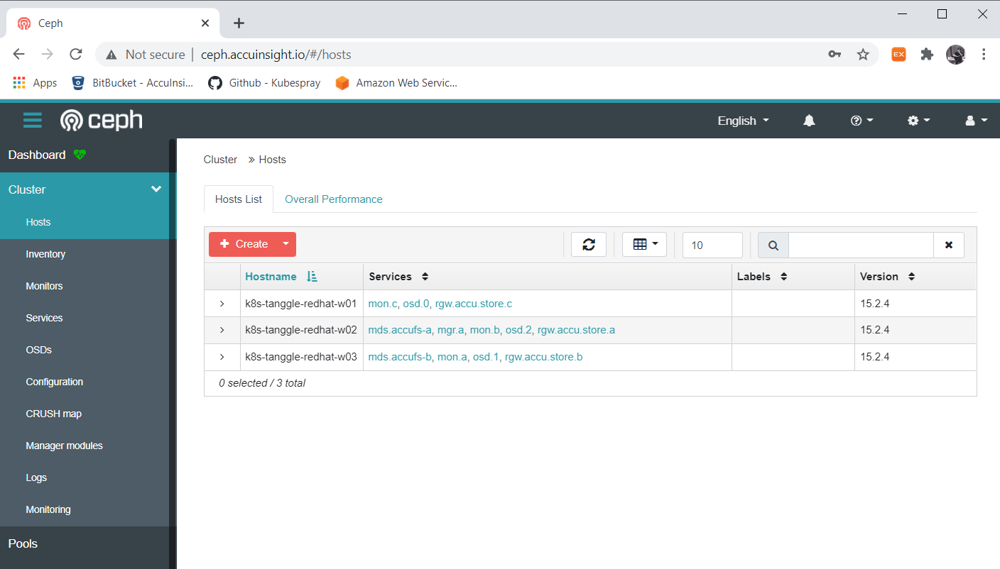

Ceph 클러스터에 포함된 모든 호스트에 대한 목록을 보여주는 화면이며 각 호스트에서 실행되고 있는 서비스들과 설치된 ceph의 버전을 확인할 수 있습니다.  

각 호스트 좌측 더보기 버튼을 클릭 시 해당 호스트에서 사용되고 있는 저장 장치에 대한 정보를 얻을 수 있습니다.

- Device ID - 저장 디바이스의 고요한 ID
- State of Health - 현재 상태
- Device Name - 디바이스 이름(예: nvme1n1)
- Daemons - 해당 OSD의 ID
  
### 2.2 Monitors

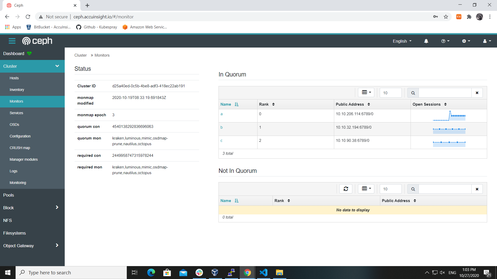

모든 Monitor 목록과 Monitor별 Quorum 상태와 열려있는 세션을 표시하는 화면입니다.  

### 2.3 OSDs  
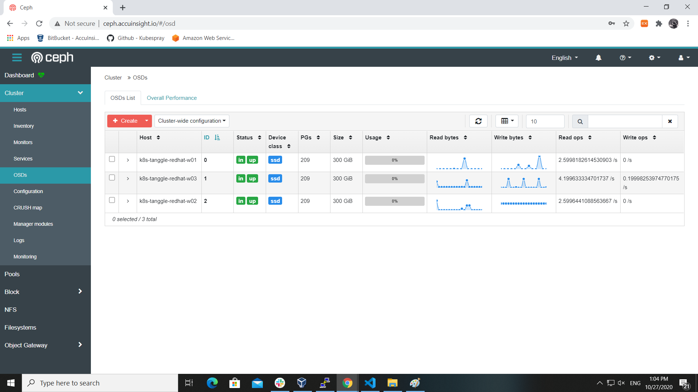

모든 OSD들을 리스트 형태로 표시하며 각 OSD별 상태와 사용통계 등 상세한 정보를 확인할 수 있습니다. 

### 2.4 Configuration

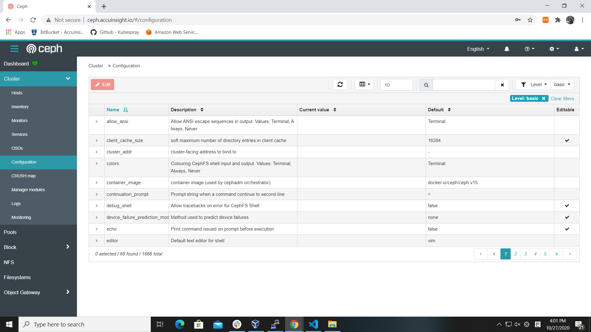

Ceph 클러스터에 대한 설정할 수 있는 모든 옵션과 각 옵션들에 대한 설명, Default 값 등을 보여 주며 현재 값 변경을 본 화면을 통해 설정할 수 있습니다.

### 2.5 CRUSH map

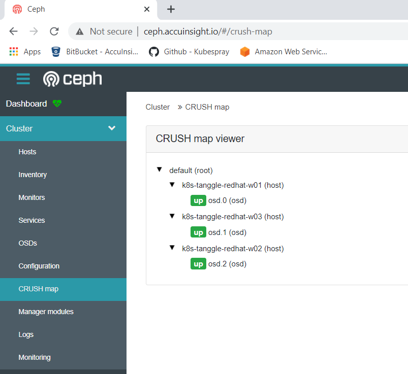

OSD들로 구성된 CRUSH Map의 구조를 확인할 수 있는 화면입니다.

### 2.6 Ceph Manager Modules

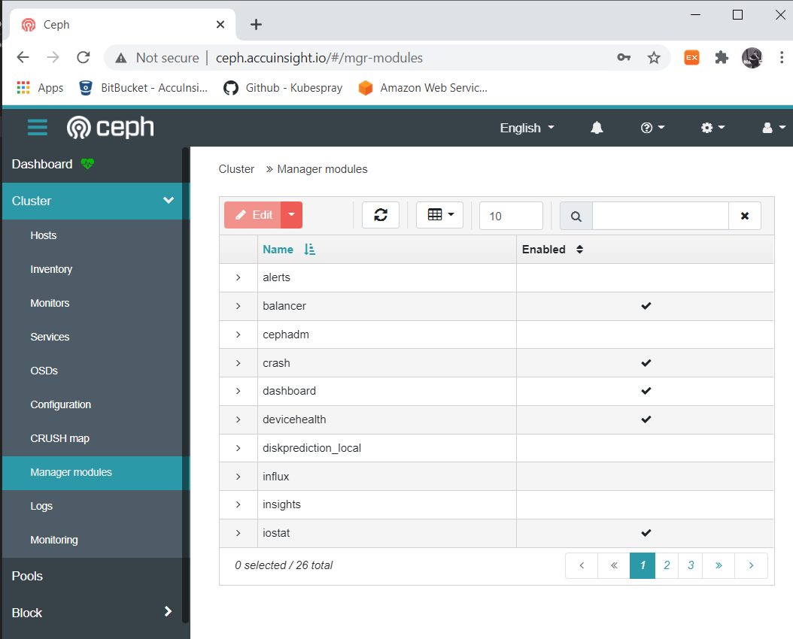

Ceph Manager Modules 탭에서는 Ceph 관리 모듈들을 활성화/비활성화 시킬 수 있으며 각 모듈 관련 세부 설정도 가능합니다.

### 2.7 Logs

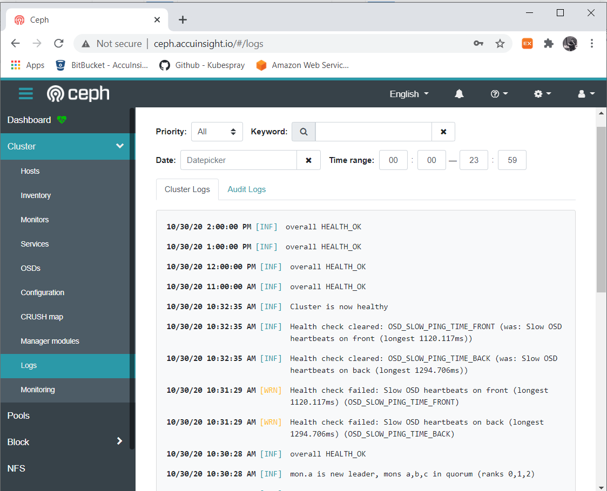

Ceph 클러스터에 대한 로그를 검색과 필터링 통해 모니토링 수 있는 화면입니다.
- **Priority** - 로그를 type로 필터링 (info, warning,error,all 중에서 선택)

## 3.Pools
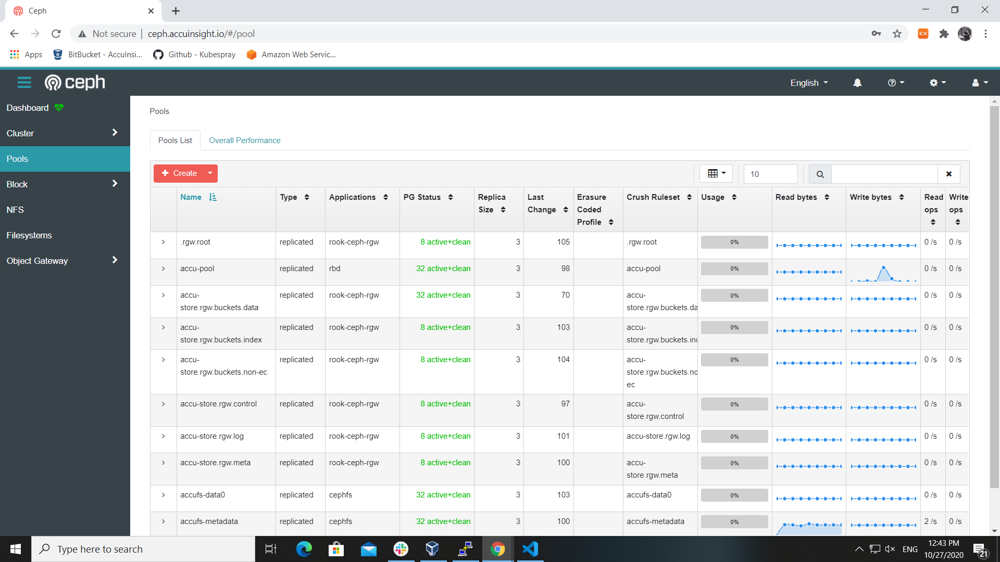

Ceph 클러스터에 있는 모든 Pool에 대한 정보(풀 타입, 사용률 등)를 제공하는 화면이며 좌측 상단에 Create 버튼을 통해 새로운 Pool 생성 및 기존 Pool들에 대한 변경도 가능합니다.

## 4.Block
- Images - RBD Image 목록. 각 Image가 어떤 Pool을 구성하고 있고 용량이 얼마나 되는지 등 RBD Image에 대한 전반적인 모니토링을 할 수 있는 화면입니다. 이미지 추가, 삭제, 변경이 가능하며 I/O Bandwidth에 대한 제한을 global, pool, image 단위로 설정할 수 있습니다. 선택된 이미지에 대한 snapshot을 추가, 삭제, 롤백도 가능합니다.
- Mirroring - Ceph 클러스터끼리 서로 Sync할 수 있는 Mirroring 기능을 설정하는 화면입니다.
- iSCSI - iSCSI Gateway들과 이를 통해 사용자에 노출되는 RBD 이미지들을 모니토링 및 관리하는 화면입니다.
  
## 5.NFS

Ganesha Daemon을 통해 생성한 NFS Export가 있을 경우 목록이 테이블에 표시 되며 새로 Export하기 위해 Create 버튼을 통해 "Create NFS export" 화면으로 이동해야 합니다.

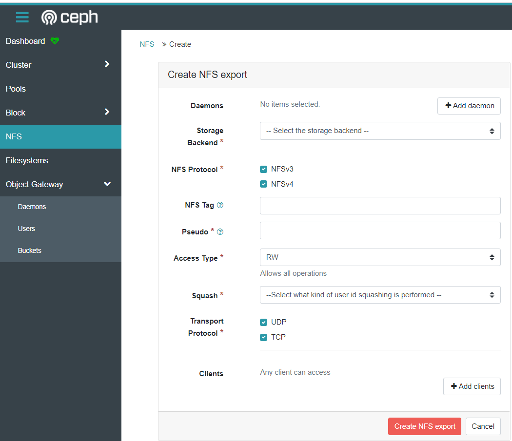

NFS Export를 생성할때는 사용할 Ganesha Daemon, 백엔드로 쓸 스토리지 타입(CephFS, Object Storage 중 선택), 사용할 프로토콜와 권한 등을 선택하고 Mount Point를 입력하면 NFS Export를 UI만을 통해 완료할 수 있습니다.

## 6.Filesystems
NFS와 마찬가지로 현재 생성되어 있는 Filesystem과 Filesystem의 생성된 시간, 활성화 여부 등 정보를 보여 주는 테이블이 메인으로 위치하고 있으며 표에 표시된 각 Filesystem의 좌측 더보기 버튼을 누를 시 더욱 상세한 정보를 얻을 수 있습니다.

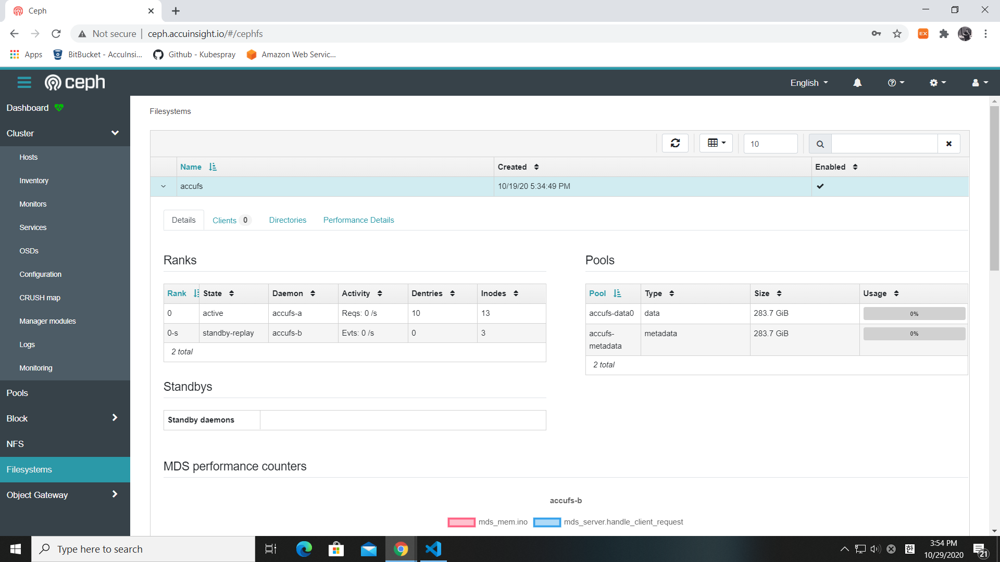

대표적으로 해당 Filesystem이 하위에 어떤 Pool들을 사용하고 있는지, 어떤 사용자들이 연결되어 있는지, Filesystem내에 디렉터리 구조가 어떻게 되는지를 모니토링 할 수 있습니다.

## 7.Object Gateway
- Daemons - Object Gateway Daemon 목록, 더보기 버튼 클릭 시 상세 정보 확인 가능합니다.
- Users - Object Storage 사용자 관리 화면입니다.
- Buckets - Object Storage의 비킷 목록 보여주며 버튼을 통해 버킷 생성, 삭제, 수정이 가능합니다.

## 8. Ceph Dashboard 사용자 관리
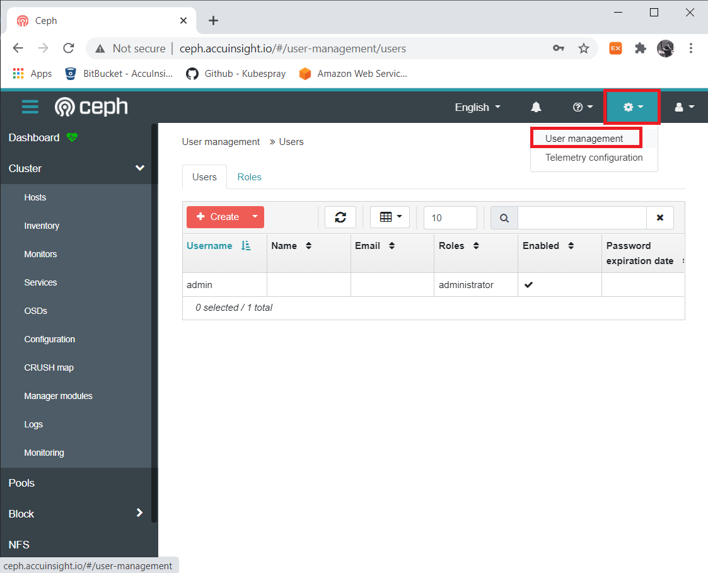

대시보드 화면 우측상단에 설정 아이콘 클릭 후 User Management 메뉴를 선택 시 대시보드 사용자 관리 화면으로 진입합니다.

본 화면은 전체 사용자 목록을 보여주는 "User" 탭과 사용자가 가질 수 있는 역할들을 보여주는 "Roles" 탭으로 이뤄집니다.

각 탭에서 새로운 사용자 또는 Role을 추가, 삭제, 수정이 가능합니다.

사용자 추가 시 사용자에 대한 권한을 설정하기 위해 사용자에게 부여하고자 하는 권한에 맞는 롤을 할당해주면 됩니다.