# Grafana UI Guide
- [Grafana UI Guide](#grafana-ui-guide)
  - [1.접속 방법](#1접속-방법)
  - [2. 메뉴 소개](#2-메뉴-소개)
    - [2.1 검색](#21-검색)
    - [2.2 새로 만들기](#22-새로-만들기)
    - [2.3 홈 화면](#23-홈-화면)
    - [2.4 Explore 화면](#24-explore-화면)
    - [2.5 알림 설정](#25-알림-설정)
    - [2.6 설정](#26-설정)
    - [2.7 Grafana Admin 설정](#27-grafana-admin-설정)
  - [3. Dashboard 생성하기](#3-dashboard-생성하기)
    - [3.1 Data Source 추가히기](#31-data-source-추가히기)
    - [3.2 Panel 생성하기](#32-panel-생성하기)
  - [4. Dashboard 화면 설명](#4-dashboard-화면-설명)
- [5. Explore 화면](#5-explore-화면)
- [6. Alert](#6-alert)
- [7. 설정](#7-설정)
  
## 1.접속 방법

 Accuinsight.yaml 파일의 accu_monitoring_grafana_fqdn 변수에 설정된 url로 브라우저에서 접속 후 로그인 화면에서 사용자 이름에 "admin", 비밀번호 입력창에 accu_monitoring_grafana_pass에 설정한 값을 입력하여 로그인합니다.

## 2. 메뉴 소개
### 2.1 검색

전체 Dashboard를 이름으로 검색하는 기능입니다.

### 2.2 새로 만들기

- Dashboard - 대쉬보드 생성 회면 이동
- Folder - 새로운 폴더 생성 회면 이동 
- Import - 대쉬보드를 json 파일 또는 url을 통해 Import하기 

### 2.3 홈 화면

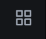

- Home - 홈 화면으로 이동 
- Manage - 대쉬보드 관리 화면 
- Playlist - Playlist 생성 및 관리
- Snapshots - Snapshot 목록

### 2.4 Explore 화면

Datasource가 제공하는 metric와 query를 테스트할 수 있는 화면

### 2.5 알림 설정

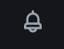

- Alert Rules - 알림 규칙 설정 화면
- Notification channels - 알림 발생시 Notification 보낼 서비스 설정

### 2.6 설정

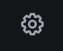

- Data sources - Metric 데이터 가져올 Data Source를 등록 및 설정
- Users - Org의 속하는 사용자들 관리
- Teams - Dashboard나 폴더에 대한 접근 권한을 팀 단위로 관리할 수 있는 화면 
- Plugins - Grafana를 확장할 수 있는 다양한 plugin 제공하는 화면입니다.
- Preferences - 개인 설정 화면 
- API Keys - Grafana API에 접속할 있는 인증 키를 관리하는 화면입니다.

### 2.7 Grafana Admin 설정

- Users - Grafana 전체 사용자 관리
- Orgs - 기관 추가와 삭제
- Settings - Grafana 시스템 설정
- Stats - Grafana 현황 통계
- Upgrade - Enterprise 버전으로 업그레이드 관련된 내용

## 3. Dashboard 생성하기
Grafana 대쉬보드는 Panel들로 구성되며 각 Panel은 query 혹은 DataSource와 연동 되어야 하기 때문에 Panel 생성하기 전에 앞서 Data Source를 추가해야 합니다.

### 3.1 Data Source 추가히기

1. DataSource를 추가하기 위해서 Configuration > Data Sources 메뉴를 통해 Data Source 관리화면으로 이동해야 합니다.

2. Add data source 버튼 클릭해 생성할 DataSource에 대한 설정 화면으로 이동합니다.

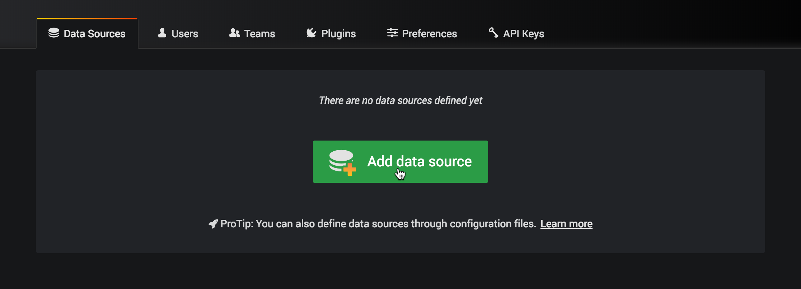

3. 추가할 Data Source에 대한 정보를 입력합니다.

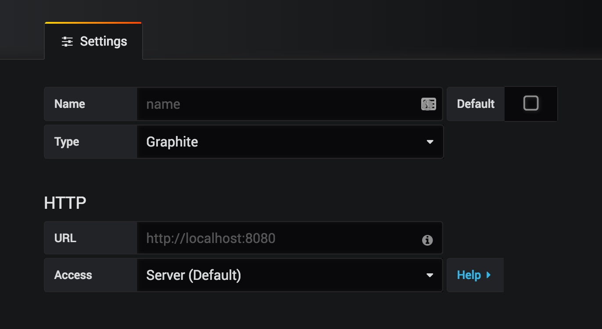

Type 필드에는 사용할 DataSource의 종류를 선택하면 되는데 [Grafana에서 지원되는 DataSource](https://grafana.com/docs/grafana/latest/datasources/#supported-data-sources) 타입을 링크에서 확인 가능합니다.

### 3.2 Panel 생성하기
1. 메인 메뉴에서 + 를 눌러 Create Dashboard를 선택 후 나온 화면에서 Add new panel 클릭
2. New Dashbard/Edit Panel 화면에서 하단에 위치한 Query 탭으로 이동.
3. 앞서 추가한 Data source중에서 해당 Panel에 표시하고자하는 데이터 소스를 선택
4. 화면 우측에 Panel에 대한 세부 설정 탭이 있으며 해당 탭에서는 Panel 이름, 설명, 데이터를 시각화할 차트 유형 등 다양한 옵션이 있으니 Metric 데이터의 특성에 맞게 설정하면 됩니다.
5. 우측상단에 위치한 Save 버튼 클릭
6. 마지막으로 Dashboard 이름을 입력 후 Save를 클릭하면 저장됩니다.

## 4. Dashboard 화면 설명

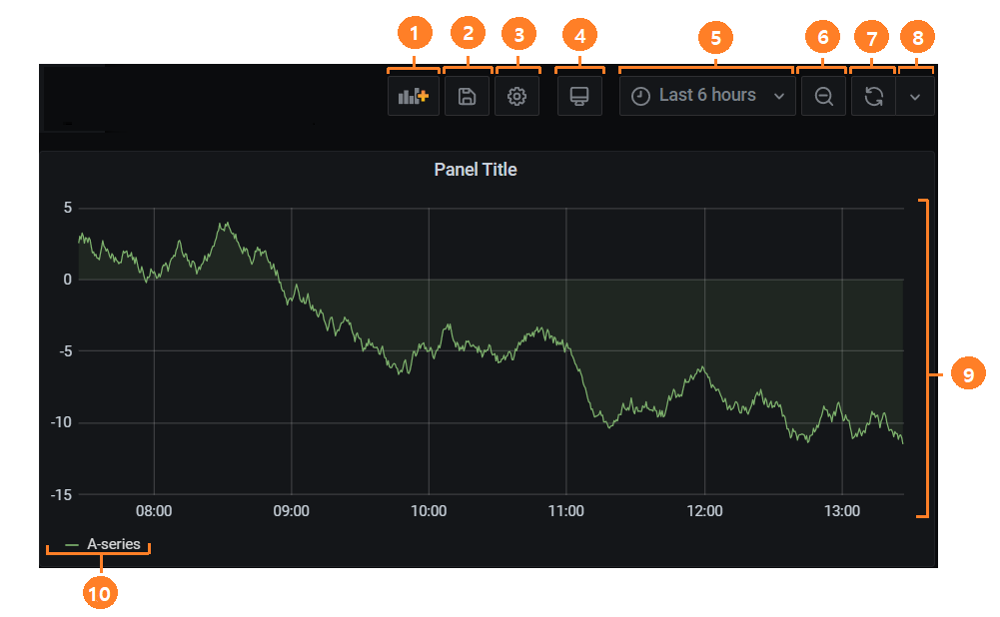  

1. 현재 Dashboard에 새 Panel 추가
2. 현재 Dashboard 저장
3. Dashboard 설정회면으로 이동
4. Cycle view 모드으로 변경
5. 데이터의 대한 시간 범위 설정
6. Panel에서의 시간 범위를 늘리기(그래프 축소)
7. 수동 새로고침 버튼. 모든 Panel들이 새로운 데이터를 가져오게 됩니다.
8. 자동 새로고침 시간 간격 설정
9. 대쉬보드 Panel. Panel을 클릭 또는 Drag&Drop 을 통해 Panel의 위치, 크기를 변경할 수 있습니다.
10. 그래프의 Legend. 색깔 변경이 가능합니다.
    

1. 홈 화면으로 이동
2. 현재 Dashboard 이름을 표시하며 클릭 시 전체 Dashboard 목록으로 이동합니다.
3. 현재 Dashboard를 스타하기. 스타로 등록된 Dashboard는 기본으로 홈 화면에 노출됩니다.
4. Dashboard 공유하기. 링크를 만들거나 Snapshot을 통해 Dashboard를 공유할 수 있습니다.

# 5. Explore 화면

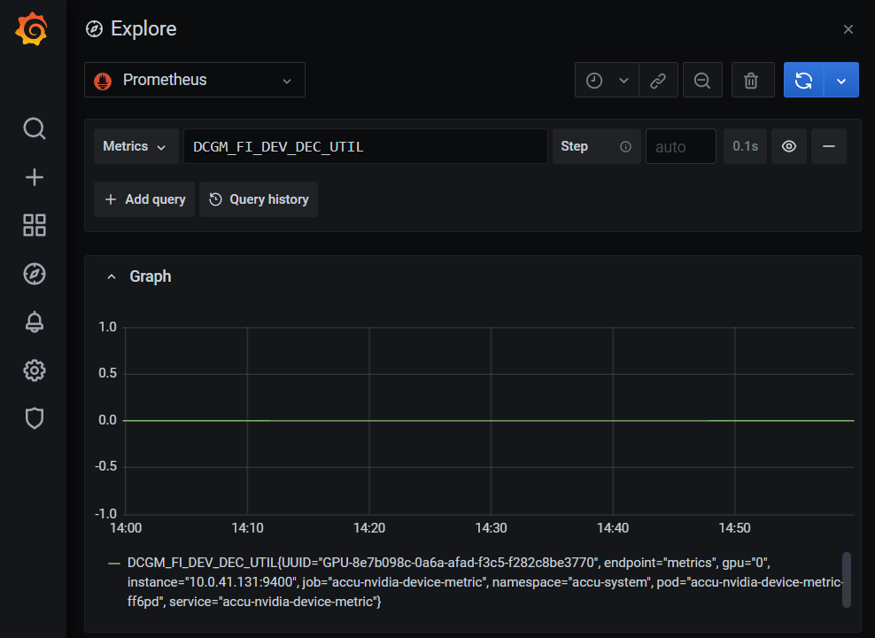

Explore 화면은 Dashboard에서 사용할 Query를 사전에 테스트하고 검증하기 위한 기능을 가지고 있습니다. 
Explore 화면에서 사용할 수 있는 기능은 아래와 같습니다:

- 원하는 DataSource를 선택 후 Query를 실행하여 데이터를 그래프와 테이블 형태로 확인
- Split 옵션울 통해 두개의 query를 동시 실행하여 결과를 비교할 수 있습니다.
- Query 기록 기능을 통해 자주 실행했거나 최근에 실행했던 query를 쉽게 재사용이 가능합니다.
- Explore 화면에서는 Metric 데이터 쿼리 뿐만 아니라 Loki, InfluxDB, ElasticSearch를 DataSource로 사용할 경우 로그 분석도 가능합니다. 
- Jaeger, Zipkin 와 연동하여 Tracing 데이터도 query 가능합니다.

# 6. Alert
- Grafana에서 Dashboard의 Panel별로 경고 규칙(Aler rule)을 설정할 수 있고 규칙의 조건dl 만족될 경우 설정한 서비스를 통해 사용자에게 알림을 전송할 수 있습니다. 
- 경고에 대한 규칙을 추가할 때는 해당 Panel의 편집 화면의 Alert 탭에서 추가해야 합니다. 규척 설정 후 해당 Dashboard를 저장하는 순간 Grafana가 규칙에 대한 설정 데이터를 따로 추출하여 별도의 스토리지에 저장 후 스케줄링 합니다. 
  
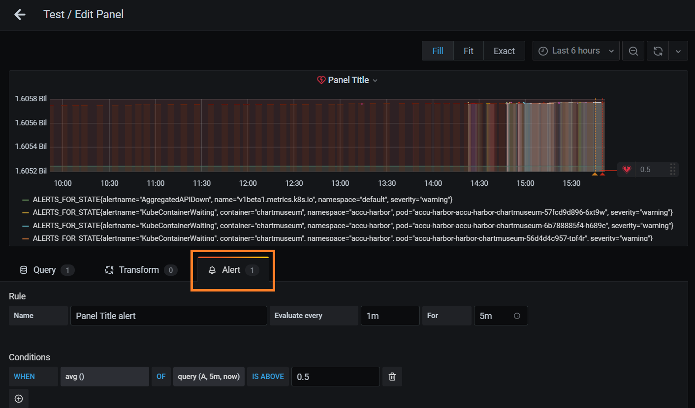

- 추가된 규칙들을 메인 메뉴의 Alerting > Alert Rules 탭을 통해 규칙 목록 확인, 규칙 삭제, 일시적으로 비활성화하기 등 기능으로 관리할 수 있습니다. 
- Notification channel 탭에서는 경고 발생 시 사용자에게 알림을 전송할 서비스(이메일, Slack 등)를 설정합니다. 
  
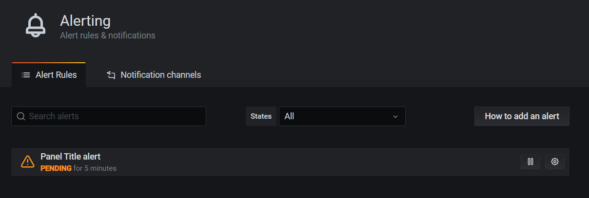

# 7. 설정

Grafana에는 사용자가 가진 권한의 따라 두가지 설정이 있습니다.

- 첫째, Grafana 관리자 설정
- 둘째, 특정 기관의 관리자 설정

각 설정은 메인 메뉴에 아래와 같은 아이콘으로 따로 표시되어 있으며 설정 변경 시 반영되는 서로 범위가 다릅니다. Grafana 관리자 같은 경우에는 모든 권한을 가지게 되며 각 기관 관리자를 추가/삭제할 수 있는 권한까지 주어진다면 기관 관리자 설정은 해당 기관내에 만들어진 Data Source, 사용자, 팀 등에만 반영됩니다. 

**기관 관리자/Grafana Admin 메뉴 아이콘**

기관 관리자 화면에서는 사용자 관리, 팀 관리, 개인화 설정 외에도 해당 기관내의 리소스를 외부 사용자가 RestFUL API로 접근할 수 있도록 인증키를 생성하여 관리할 수 있는 기능도 있습니다. 

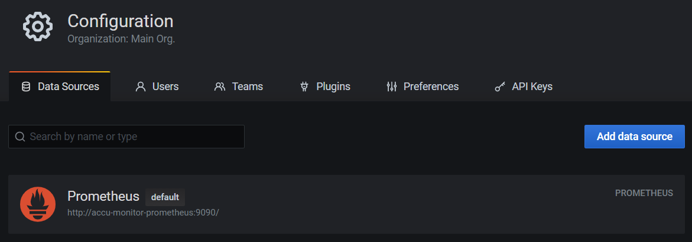

Grafana 관리자 설정 화면에서는 Org(기관)을 생성하고 관리할 수 있으며 각 기관별 관리자 설정, 모든 기관 전체 사용자 관리, 환경 설정, 전체 통계 등 기능을 사용할 수 있습니다.

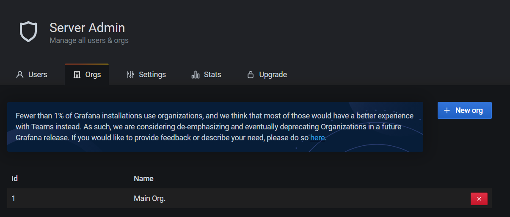